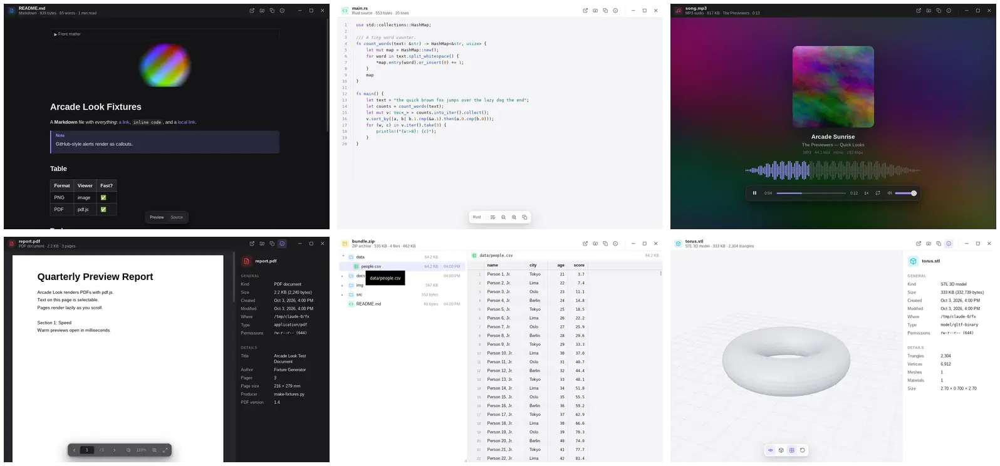

<div align="center">


# Arcade Look

**Select a file, press Space, see it instantly.**
A universal, cross-platform Quick Look for Windows, macOS and Linux.

</div>



Arcade Look previews almost anything without opening a heavy app: images, RAW photos, PSDs, video, audio, PDFs, Word/Excel/PowerPoint/OpenDocument files, EPUBs, Markdown, notebooks, JSON, CSV, source code, fonts, 3D models, archives (and the files inside them), folders, and raw binaries. Anything else gets a file card plus a hex view, so **no file ever fails to preview**.

It's built to be light: a Rust core on the OS's own web engine (no bundled Chromium), a ~17 KB (gzipped) UI shell, and heavy renderers such as PDF, 3D and syntax highlighting loaded only when a file needs them.

## Highlights

- **Instant.** The app stays warm in the background after the first preview. Measured on a software-rendered Linux VM: about 100–150 ms from the command to a visible preview, and 15–40 ms of that is rendering. The first launch takes about 0.65 s.
- **Never breaks.** Every viewer has a fallback chain that ends at *info card + hex*. Reads are capped and time-budgeted, so a 50 GB disk image, a 2 GB `.tar.gz` or a 100k-row CSV opens immediately. Panics inside decoders become error messages instead of crashes.
- **Safe with untrusted files.** HTML renders in a fully sandboxed frame (no scripts), Markdown/DOCX/EPUB/notebook HTML is rebuilt from an allow-list, SVG scripts never run, and archive extraction is zip-slip proof.
- **Keyboard-first.** `Space`/`Esc` to close, `←`/`→` to flip through the folder, `Enter` to open, `I` for info. Press `?` for everything.
- **Extensible.** Wrap any CLI tool as a previewer with a 6-line `plugin.json`, or write a JavaScript renderer. See [docs/PLUGINS.md](docs/PLUGINS.md).

## What it previews

| | Formats | Notes |
|---|---|---|
| 🖼 Images | PNG, JPEG, GIF/APNG, WebP, AVIF, BMP, ICO, SVG, TIFF, TGA, DDS, HDR, EXR, QOI, PNM, **PSD/PSB**, **camera RAW** (CR2, CR3, NEF, ARW, DNG, ORF, RW2, RAF, PEF…), HEIC/JXL where the OS supports them | Zoom to cursor, pan, rotate, 1:1, pixel-art scaling, transparency checkerboard, EXIF & GPS |
| 🎬 Video | MP4, MOV, WebM, MKV, OGV, M4V, … | Streamed with HTTP Range, so huge files seek instantly. Custom player with speed, loop and fullscreen |
| 🎵 Audio | MP3, FLAC, WAV, OGG, Opus, M4A, AAC, AIFF, … | Cover art, tags, waveform, blurred-artwork backdrop |
| 📄 PDF | PDF (and PDF-compatible `.ai`) | pdf.js: lazy page rendering, selectable text, zoom, page jump, metadata |
| 📝 Documents | DOCX, ODT, RTF, EPUB | Headings, emphasis, lists, tables, links and embedded images on a paper-style page |
| 📊 Tables | CSV/TSV (delimiter and encoding sniffing), XLSX, XLSM, XLSB, XLS, ODS | Virtualized grid, sheet tabs, numeric alignment |
| 📽 Slides | PPTX, ODP | Slide cards with titles, bullets, images, tables and speaker notes |
| ✍️ Markdown | `.md`, `.mdx`, … | GitHub-flavored: tables, task lists, footnotes, alerts, front matter, highlighted code, relative images, local links |
| 💻 Code & text | ~150 languages and well-known files (Dockerfile, Makefile, …) | Line numbers, wrap, font size, UTF-8/16 and legacy encoding detection |
| 🧩 Data | JSON, JSON Lines, GeoJSON, Jupyter notebooks | Collapsible JSON tree with lazy expansion; notebooks show Markdown, code and text/image/HTML outputs |
| 🗜 Archives | ZIP (and JAR/APK/WHL/…), TAR, TAR.GZ/BZ2/XZ/ZST, GZ, BZ2, XZ, ZST, 7Z | Tree view; **click any entry to preview it in place** |
| 🔤 Fonts | TTF, OTF, TTC, WOFF, WOFF2 | Editable sample, size waterfall, variable-axis sliders, glyph grid |
| 🧊 3D | glTF/GLB, OBJ (+MTL), STL, PLY, FBX, DAE, 3MF | Orbit, auto-rotate, wireframe, grid, PBR lighting, animations |
| 🌐 Web | HTML | Sandboxed render plus a source view |
| 📁 Folders | any | Size (time-budgeted), item grid with thumbnails; click to drill in, `Backspace` to go back |
| 🔢 Anything else | any | File card with a virtualized hex viewer that reads on demand |

More screenshots: [video](docs/screenshots/video.webp) · [image](docs/screenshots/image.webp) · [Word](docs/screenshots/docx.webp) · [notebook](docs/screenshots/notebook.webp) · [font](docs/screenshots/font.webp) · [welcome](docs/screenshots/welcome.webp)

## Install

Download the installer for your platform from the [Releases](../../releases) page, or [build from source](#build-from-source). Every commit to `main` is also built: open the latest [CI run](../../actions/workflows/ci.yml) and download the installer from its **Artifacts**.

| Platform | Download | Install |
|---|---|---|
| **Windows 10/11** | `Arcade Look_<version>_x64-setup.exe` | Run it (no admin needed). It sets up Space in File Explorer, the **Quick Look** context-menu item and start at login. |
| **Linux** (x86_64) | `Arcade Look_<version>_amd64.AppImage` | `chmod +x` it, keep it somewhere permanent (e.g. `~/Applications`) and run it once. |
| **macOS 10.15+** (Apple Silicon and Intel) | `Arcade Look_<version>_universal.dmg` | Drag it to Applications and open it from there. |

The first run sets everything up: file manager integration, and **start on login** so Arcade Look waits in the background with an icon in the system tray (click it for Settings, right-click for the menu). Turn start on login off in Settings. The builds aren't code-signed yet, so the first time Windows SmartScreen needs **More info → Run anyway** and macOS needs **right-click → Open**.

| Platform | How you preview |
|---|---|
| **Linux: GNOME Files** | Select a file and press **Space** (Arcade Look implements the same D-Bus previewer protocol as GNOME Sushi). Run `nautilus -q` once after the first run. |
| **Linux: Dolphin, Nemo** | Right-click → **Quick Look** |
| **Linux: other file managers** | *Open With → Arcade Look*, or bind a custom action to `arcade-look %f` |
| **Windows: File Explorer** | Select a file and press **Space** (also works on the desktop), or right-click → **Quick Look** |
| **macOS: Finder** | Select a file and press **Ctrl+Option+Space** (Finder's own Space stays Apple's Quick Look). Allow Arcade Look to control Finder when macOS asks. |

To set up the integration again, click **Set up file manager integration** in Settings or run `arcade-look --install-integration`; `--uninstall-integration` removes it.

You can always preview from a terminal: `arcade-look path/to/file`, or drop a file onto the window.

## Keyboard shortcuts

| Key | Action |
|---|---|
| `Space` / `Esc` | Close the preview |
| `←` / `→` | Previous / next file in the folder |
| `Backspace` / `Alt+←` | Back (after drilling into a folder or link) |
| `Enter` / `Ctrl+O` | Open with the default app |
| `Ctrl+R` | Show in folder |
| `Ctrl+C` | Copy path (when no text is selected) |
| `I` | Info panel |
| `F` | Fullscreen |
| `+` `−` `0` `1` | Zoom in / out / fit / actual size |
| `R` | Rotate image |
| `W` | Wrap lines (text) · wireframe (3D) |
| `K` `J` `L` `M` `,` `.` | Play/pause, −10 s, +10 s, mute, slower, faster |
| `?` | All shortcuts |
| `Ctrl+Q` | Quit |

(`Cmd` instead of `Ctrl` on macOS.)

## Configuration

Settings live in `config.json` in your config folder: `~/.config/arcade-look/` on Linux, `~/Library/Application Support/arcade-look/` on macOS, and `%APPDATA%\arcade-look\` on Windows. The welcome screen links to it.

```jsonc
{
  "theme": "system",            // "system" | "light" | "dark"
  "idleMinutes": 10,            // release memory after the window has been hidden this long (0 = never)
  "globalShortcut": "Ctrl+Alt+Space", // "" disables (default on Linux)
  "explorerSpace": true,        // Windows: Space in File Explorer
  "nautilusPreviewer": true,    // Linux: Space in GNOME Files
  "textLimitMb": 4,             // text previews read at most this much
  "highlightLimitKb": 512,      // no syntax colors above this size
  "autoplay": true,             // start video/audio automatically
  "plugins": true,
  "showHidden": false           // include dotfiles when pressing ←/→
}
```

**Memory.** After you close a preview, the window stays warm so the next one is instant. Once it has been hidden for `idleMinutes`, the web view is released. The process then exits, unless it's needed in the background (start on login, the tray icon, the Windows Explorer hook or a global shortcut), in which case only a few MB stay resident.

## Plugins

Two kinds:

- **Command plugins** turn any CLI into a previewer. The output can be HTML, text, Markdown, an image, or a *file* that gets previewed by the matching built-in viewer. For example, LibreOffice converting `.doc` to PDF gets the full PDF viewer.
- **Script plugins** are ES modules that render into the preview pane.

```json
{
  "name": "Legacy Office via LibreOffice",
  "type": "command",
  "extensions": ["doc", "ppt"],
  "command": ["soffice", "--headless", "--convert-to", "pdf", "--outdir", "{outdir}", "{path}"],
  "output": "file"
}
```

Ready-made examples are in [`examples/plugins`](examples/plugins) (LibreOffice, Pandoc, ffmpeg transcoding fallback, SQLite schema, color palettes). The full reference is in [docs/PLUGINS.md](docs/PLUGINS.md).

## Build from source

Requirements: [Rust](https://rustup.rs) (stable, 1.88+), Node.js 20+, and on Linux the [Tauri system dependencies](https://tauri.app/start/prerequisites/) (`libwebkit2gtk-4.1-dev`, `libgtk-3-dev`, `librsvg2-dev`, …).

```sh
npm install
npm run tauri dev            # run with hot reload
npm run tauri build          # installers in src-tauri/target/release/bundle/
```

CI (`.github/workflows`) checks every pull request, and packages every push to `main` (`build.yml`: NSIS setup `.exe`, AppImage, universal `.dmg`). Pushing a tag that matches the version in `src-tauri/tauri.conf.json` (e.g. `v0.2.0`) creates a draft GitHub Release with those installers attached.

Checks:

```sh
npm run typecheck && npm run build
cd src-tauri && cargo fmt --check && cargo clippy --all-targets -- -D warnings && cargo test
```

`npm run fixtures` writes a sample of every supported format to `fixtures/` for manual testing. Set `ALOOK_DEBUG=1` to print lifecycle, protocol and UI diagnostics to stderr.

## How it works

```
file manager ──Space──▶ OS integration ──▶ Rust core ──IPC / alook://──▶ web UI (lazy viewers)
                         Linux: D-Bus     detect · parse · stream          registry → fallback chain
                         Windows: hook    (Range-aware protocol)           image · pdf · code · …
                         macOS: shortcut
```

- **Rust core** (`src-tauri/src`): magic-byte and extension detection, parsers (Office XML, archives, fonts, tags, EXIF, PSD, RAW previews), a streaming `alook://` protocol with HTTP Range, plugins, and window lifecycle.
- **Web UI** (`src/`): vanilla TypeScript with no framework runtime. Each viewer is its own lazily loaded chunk with `mount()`/`dispose()`. A viewer that throws falls through to the next one.
- On Linux, `<video>`/`<audio>` stream from a token-protected loopback HTTP server, because WebKitGTK's media stack can't stream from custom URL schemes.

The full design rationale is in [docs/PLAN.md](docs/PLAN.md).

## Known limits

- Video and audio codecs are whatever the OS web engine supports: WebView2 on Windows, AVFoundation on macOS, GStreamer on Linux (install `gstreamer1.0-libav` for H.264/AAC). Unsupported media falls back to the info card; the ffmpeg example plugin can transcode it.
- Legacy binary `.doc`/`.ppt` need the LibreOffice plugin. (`.xls` works natively.)
- Wayland doesn't allow global shortcuts or reading another app's selection, so on Linux, Space works through GNOME Files' previewer protocol, and other file managers use *Open With* or custom actions.
- The Windows Explorer hook and macOS Finder integration are compiled and linted in CI on their platforms; the Linux path was exercised end to end during development.

## License

[MIT](LICENSE)
